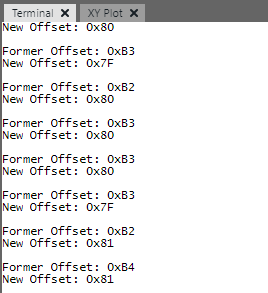
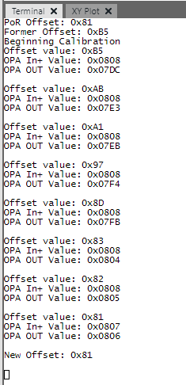

<!-- Please do not change this html logo with link -->

# Input Offset Voltage Correction on PIC18F16Q41
The Operational Amplifier (OPA) module in the PIC18-Q41 family is a general-purpose operational amplifier. In applications where the devices are subjected to non-ambient temperatures, the input offset voltage of the OPA module can change and cause errors on the output of the peripheral. To compensate for this effect, the ADC can be used to adjust the offset correction register in field. This code example demonstrates this algorithm at ambient temperature by simulating offset error through constant changes to the offset register.

## Related Documentation

[TB3280: Using Operational Amplifiers in PIC16 and PIC18](http://ww1.microchip.com/downloads/en/DeviceDoc/Using-the-Operational-Amplifier-on-PIC16-and-PIC18-90003280A.pdf)  

[Code Example: Gain and Offset Calibration of the Analog Signal Conditioning (OPAMP) Peripheral (MPLAB)](https://github.com/microchip-pic-avr-examples/avr128db48-opamp-gain-and-offset-calibration-mplab)  
[Code Example: Gain and Offset Calibration of the Analog Signal Conditioning (OPAMP) Peripheral (Studio)](https://github.com/microchip-pic-avr-examples/avr128db48-opamp-gain-and-offset-calibration)  

## Software Used

* <a href="http://www.microchip.com/mplab/mplab-x-ide">MPLAB® IDE 5.40 or newer</a>
* <a href="https://www.microchip.com/mplab/compilers">Microchip XC8 Compiler 2.20 or newer</a>
* <a href="https://www.microchip.com/mplab/mplab-code-configurator">MPLAB® Code Configurator (MCC) 3.95.0 or newer</a>
* Serial Terminal (used for displaying the calibration results)

## Hardware Used

* <a href="https://www.microchip.com/wwwproducts/en/PIC18F16Q41">PIC18F16Q41 Product Information</a> 
* <a href="https://www.microchip.com/DevelopmentTools/ProductDetails/PartNO/DM164137"> Microchip Curiosity Development Board (DM164137), Rev 4 </a>
* *(Optional)* Variable Power Supply (1 - 5V range) for testing the OPA Module

## Setup
#### Wiring 
 

| Wire    | Description
| ------- | -------------
| Orange  | UART Transmit
| Blue    | Output of the Operational Amplifier
| Green   | Inverting Input to the Operational Amplifier

#### Pin Table

For electrical schematics of the design, please refer to the Implementation section below.

| Pin | Name          | Description
| --- | ------------- | -----------
| RC2 | OPA1OUT       | Output of the operational amplifier
| RB7 | UART TX       | UART Transmit Output, 9600 BAUD
| RB4 | OPA1IN0-      | Inverting Input to the OPA Module1
| RA2 | LED D6        | Calibrating Indicator LED
| TX  | UART Transmit | Curiosity board UART transmit pin. Connect to RB7

**Note:** 
1. Input should be low-impedance. If choosing not to use the power supply, leave this pin open. Doing so will cause the output of the OPA module to be ~Vdd/2. 

## Operation

#### Important
Calibration in-field is dependent on the environment near and around the device. It is unlikely to be as accurate or precise as a calibration in a lab environment.

#### Theory of Operation
To correctly calibrate the OPA module, it is important to remove as many variables as possible. The 1st variable to remove is gain error. Ideally, the gain of the OPA module is known exactly, however tolerance errors in the feedback resistors (internal or external) can cause errors that can impact the performance of the calibration.

To remove these errors from the calibration, the module is forced into unity gain and disconnects the feedback resistors from the inverting input. The device measures the signal on the non-inverting input and the signal on the output through the ADCC, and computes the error. A response is generated depending on the magnitude of the error.

The response is applied, and the process repeats until:
* Calibration is within a set tolerance (in bits).
* The output oscillates around the tolerance 8 times.
* Too many cycles (max 255) have elapsed, which indicates a failed calibration.

The algorithm is illustrated in Figure 1 below.

 
*Figure 1 - Calibration Flowchart*

#### Implementation
To demonstrate this algorithm, the program needs to force the offset to become incorrect. It does this by changing the offset correction register every 10ms (while not calibrating). This is an extreme case (temperature changes are much more subtle than this). The end result is that the offset register needs to be corrected in the calibration routine to account for the errors in the register.

Theoretically, any configuration of the OPA module can run this algorithm. For simplicity, the OPA module is configured as an inverting amplifier, with a gain of -1, and a level shift of Vdd/2. The ideal output function of this configuration in this setup is simply: **Vout = Vdd - Vin**. The configuration when not in sleep is shown in Figure 2. 

 
*Figure 2 - Normal Operating Mode* 

When the device is to be calibrated, it switches the configuration to that of a unity gain buffer. Vdd/2, which normally level-shifts the input, now provides the reference used for calibration. Figure 3 (below), shows the configuration. 

 
*Figure 3 - Calibration Mode Schematic*

Measurements of both the non-inverting and inverting input are done through the ADCC, with the Fixed Voltage Reference (FVR) at 4.096V. **For proper operation, Vout must be less than 4.096V**. The ADCC is setup in a burst average mode during which the system acquires 32 samples and then averages them by right shifting by 5. The device is in sleep during the conversion to further reduce noise and possible sources of error.

If the two measurements are within a set accuracy, the calibration routine stops. If the measurements are out of accuracy, a small Look-Up Table (LUT) is used to find a response to apply to the offset register. This process is repeated until the measurements are within tolerance, or an error occurs (see Program Options and Constants for a listing of error codes). Once finished, the program outputs the starting register value and the ending register value. This can be compared with the factory default value that is printed on startup.  

## Program Output

 
*Figure 4 - Standard Serial Output*

 
*Figure 4 - Standard Serial Output with Debug Printing*

## Macros and Constants (constants.h)

#### Output Enable Macros
- **STD_OUTPUT**, enables UART printing of standard messages, such as original value, final value, and PoR reset.
- **DEBUG_OUTPUT**, enables UART printing of verbose debug messages. Also prints the measured voltages (in hex) on each iteration of the calibration. Can be set without STD_OUTPUT enabled.

#### Operating Constants

- **ACCURACY**, sets the number of bits to calibrate to. To convert from bits to voltage, multiply the voltage per step resolution of the ADCC by this macro.

#### Error Codes

- **NO_ERROR (0)** - No error has occurred in the program.
- **POS_OFFSET_ERROR (1)** - The program has reached 0xFF in OPA1OFFSET and the increment is positive.
- **NEG_OFFSET_ERROR (2)** - The program has reached 0x00 in OPA1OFFSET and the increment is negative.
- **INFINITE_ERROR (3)** - The program has exceeded the number of allowed cycles.
- **OSCILLATING_ERROR (4)**  - The offset is oscillating, and cannot be resolved any farther.

## Summary
This code example demonstrates an algorithm for calibrating the input offset voltage of the OPA module in PIC18F16Q41.
